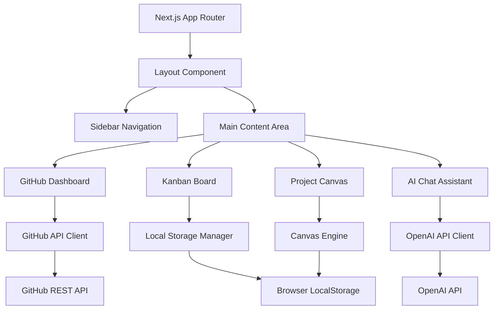

# Design Document

## Overview

The Devorch Suite is architected as a modular Next.js application using the App Router pattern with TypeScript. The platform integrates four core productivity modules through a unified interface, leveraging modern React patterns, shadcn/ui components, and local storage for data persistence. The design emphasizes modularity, performance, and user experience through a cohesive dark theme interface.

## Architecture

### High-Level Architecture



### Technology Stack

- **Frontend Framework**: Next.js 14+ with App Router and TypeScript
- **UI Components**: shadcn/ui built on Radix UI primitives
- **Styling**: Tailwind CSS with CSS custom properties for theming
- **State Management**: React hooks with Context API for global state
- **Data Persistence**: Browser localStorage with structured data models
- **External APIs**: GitHub REST API, OpenAI API
- **Canvas Rendering**: Konva.js with react-konva for 2D graphics
- **Drag & Drop**: react-beautiful-dnd for Kanban interactions
- **Charts**: Recharts for data visualization
- **Animations**: Framer Motion for smooth transitions

## Components and Interfaces

### Core Layout Components

#### AppLayout
```typescript
interface AppLayoutProps {
  children: React.ReactNode;
}

// Provides the main application shell with sidebar and content area
```

#### Sidebar Navigation
```typescript
interface SidebarProps {
  currentModule: ModuleType;
  onModuleChange: (module: ModuleType) => void;
  isCollapsed: boolean;
  onToggleCollapse: () => void;
}

type ModuleType = 'dashboard' | 'kanban' | 'canvas' | 'chat';
```

### Module Components

#### GitHub Dashboard
```typescript
interface GitHubDashboardProps {
  repositories: Repository[];
  isLoading: boolean;
  onRefresh: () => void;
}

interface Repository {
  id: string;
  name: string;
  fullName: string;
  description: string;
  language: string;
  starCount: number;
  forkCount: number;
  lastUpdated: Date;
  recentCommits: Commit[];
  openIssues: Issue[];
  pullRequests: PullRequest[];
}
```

#### Kanban Board
```typescript
interface KanbanBoardProps {
  boardId: string;
  columns: Column[];
  onCardMove: (cardId: string, sourceColumn: string, targetColumn: string) => void;
  onCardCreate: (columnId: string, card: Partial<Card>) => void;
  githubSync?: GitHubSyncConfig;
}

interface Column {
  id: string;
  title: string;
  cards: Card[];
  color: string;
}

interface Card {
  id: string;
  title: string;
  description: string;
  labels: Label[];
  assignee?: string;
  dueDate?: Date;
  githubIssueId?: string;
}
```

#### Project Canvas
```typescript
interface ProjectCanvasProps {
  canvasId: string;
  elements: CanvasElement[];
  onElementCreate: (element: Partial<CanvasElement>) => void;
  onElementUpdate: (elementId: string, updates: Partial<CanvasElement>) => void;
  onElementDelete: (elementId: string) => void;
}

interface CanvasElement {
  id: string;
  type: 'text' | 'shape' | 'connector';
  position: { x: number; y: number };
  size: { width: number; height: number };
  properties: Record<string, any>;
  style: ElementStyle;
}
```

#### AI Chat Assistant
```typescript
interface AIChatProps {
  messages: ChatMessage[];
  onSendMessage: (message: string) => void;
  isProcessing: boolean;
  codebaseContext?: CodebaseContext;
}

interface ChatMessage {
  id: string;
  role: 'user' | 'assistant';
  content: string;
  timestamp: Date;
  codeReferences?: CodeReference[];
}
```

### API Clients

#### GitHub API Client
```typescript
class GitHubApiClient {
  private accessToken: string;
  
  async authenticate(code: string): Promise<AuthResult>;
  async getRepositories(): Promise<Repository[]>;
  async getRepository(owner: string, repo: string): Promise<Repository>;
  async getIssues(owner: string, repo: string): Promise<Issue[]>;
  async createIssue(owner: string, repo: string, issue: CreateIssueRequest): Promise<Issue>;
  async updateIssue(owner: string, repo: string, issueNumber: number, updates: UpdateIssueRequest): Promise<Issue>;
}
```

#### OpenAI API Client
```typescript
class OpenAIApiClient {
  private apiKey: string;
  
  async analyzeCode(code: string, context: string): Promise<CodeAnalysis>;
  async chatCompletion(messages: ChatMessage[], context?: string): Promise<string>;
  async generateSuggestions(codebase: CodebaseContext): Promise<Suggestion[]>;
}
```

### Data Management

#### Local Storage Manager
```typescript
class LocalStorageManager {
  async save<T>(key: string, data: T): Promise<void>;
  async load<T>(key: string): Promise<T | null>;
  async remove(key: string): Promise<void>;
  async clear(): Promise<void>;
  
  // Specialized methods for each module
  async saveKanbanBoard(board: KanbanBoard): Promise<void>;
  async loadKanbanBoards(): Promise<KanbanBoard[]>;
  async saveCanvasProject(project: CanvasProject): Promise<void>;
  async loadCanvasProjects(): Promise<CanvasProject[]>;
}
```

## Data Models

### Core Data Structures

#### User Session
```typescript
interface UserSession {
  id: string;
  githubToken?: string;
  preferences: UserPreferences;
  lastActive: Date;
}

interface UserPreferences {
  theme: 'dark' | 'light';
  sidebarCollapsed: boolean;
  defaultModule: ModuleType;
  githubSyncEnabled: boolean;
}
```

#### GitHub Integration
```typescript
interface GitHubConnection {
  accessToken: string;
  refreshToken?: string;
  expiresAt: Date;
  scopes: string[];
  user: GitHubUser;
}

interface GitHubUser {
  id: number;
  login: string;
  name: string;
  email: string;
  avatarUrl: string;
}
```

#### Kanban Data Model
```typescript
interface KanbanBoard {
  id: string;
  name: string;
  description: string;
  columns: Column[];
  githubRepo?: {
    owner: string;
    repo: string;
    syncConfig: SyncConfiguration;
  };
  createdAt: Date;
  updatedAt: Date;
}

interface SyncConfiguration {
  enabled: boolean;
  columnMappings: Record<string, string>; // column id -> github label
  autoSync: boolean;
  syncInterval: number; // minutes
}
```

#### Canvas Data Model
```typescript
interface CanvasProject {
  id: string;
  name: string;
  description: string;
  elements: CanvasElement[];
  viewport: {
    x: number;
    y: number;
    zoom: number;
  };
  createdAt: Date;
  updatedAt: Date;
}

interface CanvasElement {
  id: string;
  type: ElementType;
  position: Point;
  size: Size;
  rotation: number;
  style: ElementStyle;
  data: Record<string, any>;
  connections: Connection[];
}

type ElementType = 'text' | 'rectangle' | 'circle' | 'arrow' | 'connector';
```

#### AI Chat Data Model
```typescript
interface ChatSession {
  id: string;
  name: string;
  messages: ChatMessage[];
  codebaseContext?: CodebaseContext;
  createdAt: Date;
  updatedAt: Date;
}

interface CodebaseContext {
  files: CodeFile[];
  structure: ProjectStructure;
  analysis: CodeAnalysis;
}

interface CodeFile {
  path: string;
  content: string;
  language: string;
  size: number;
  lastModified: Date;
}
```

## Error Handling

### Error Types and Strategies

#### API Error Handling
```typescript
class ApiError extends Error {
  constructor(
    public status: number,
    public code: string,
    message: string,
    public retryable: boolean = false
  ) {
    super(message);
  }
}

// GitHub API specific errors
class GitHubApiError extends ApiError {
  static fromResponse(response: Response): GitHubApiError;
}

// OpenAI API specific errors  
class OpenAIApiError extends ApiError {
  static fromResponse(response: Response): OpenAIApiError;
}
```

#### Error Boundary Implementation
```typescript
interface ErrorBoundaryState {
  hasError: boolean;
  error?: Error;
  errorInfo?: ErrorInfo;
}

class ModuleErrorBoundary extends Component<PropsWithChildren, ErrorBoundaryState> {
  // Catches errors within individual modules
  // Provides fallback UI and error reporting
  // Allows other modules to continue functioning
}
```

#### Retry and Fallback Strategies
- **GitHub API**: Exponential backoff with jitter, respect rate limits
- **OpenAI API**: Queue requests, implement circuit breaker pattern
- **Local Storage**: Graceful degradation to memory-only storage
- **Network Failures**: Show cached data with staleness indicators

## Testing Strategy

### Unit Testing
- **Components**: React Testing Library for UI component testing
- **Hooks**: Custom hook testing with renderHook utility
- **API Clients**: Mock HTTP responses with MSW (Mock Service Worker)
- **Data Models**: Jest for business logic and data transformation testing
- **Utilities**: Pure function testing with comprehensive edge cases

### Integration Testing
- **Module Integration**: Test interactions between components within modules
- **API Integration**: Test actual API calls with test accounts/keys
- **Storage Integration**: Test localStorage operations with different browser states
- **Cross-Module Communication**: Test data sharing between modules

### End-to-End Testing
- **User Workflows**: Playwright for complete user journey testing
- **GitHub OAuth Flow**: Test authentication and token management
- **Kanban-GitHub Sync**: Test bidirectional synchronization
- **Canvas Persistence**: Test save/load operations across sessions
- **AI Chat Interactions**: Test conversation flows and context management

### Performance Testing
- **Bundle Size**: Monitor JavaScript bundle sizes with webpack-bundle-analyzer
- **Runtime Performance**: React DevTools Profiler for component performance
- **Memory Usage**: Monitor memory leaks in long-running sessions
- **API Response Times**: Track and alert on API performance degradation

### Accessibility Testing
- **Screen Reader Compatibility**: Test with NVDA, JAWS, and VoiceOver
- **Keyboard Navigation**: Ensure all functionality accessible via keyboard
- **Color Contrast**: Automated testing with axe-core
- **Focus Management**: Test focus trapping in modals and complex interactions

### Browser Compatibility Testing
- **Modern Browsers**: Chrome, Firefox, Safari, Edge (latest 2 versions)
- **Mobile Browsers**: iOS Safari, Chrome Mobile, Samsung Internet
- **Feature Detection**: Graceful degradation for unsupported features
- **LocalStorage Limits**: Test behavior when storage quotas are exceeded

## Security Considerations

### Authentication and Authorization
- **GitHub OAuth**: Secure token storage, automatic refresh handling
- **API Key Management**: Environment variable configuration, no client-side exposure
- **Session Management**: Secure session storage, automatic cleanup

### Data Protection
- **Local Storage Encryption**: Sensitive data encryption before storage
- **API Communication**: HTTPS-only communication, request signing
- **XSS Prevention**: Content Security Policy, input sanitization
- **CSRF Protection**: SameSite cookies, request validation

### Privacy
- **Data Minimization**: Only collect necessary user data
- **Consent Management**: Clear privacy policy, user consent tracking
- **Data Retention**: Automatic cleanup of old data, user deletion rights