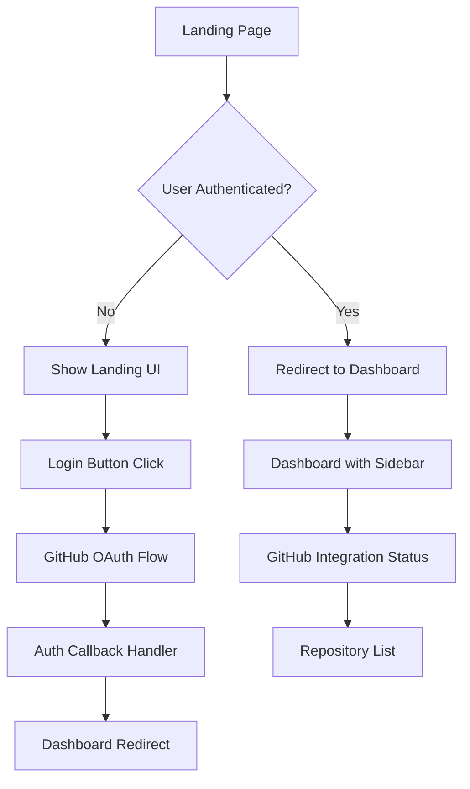
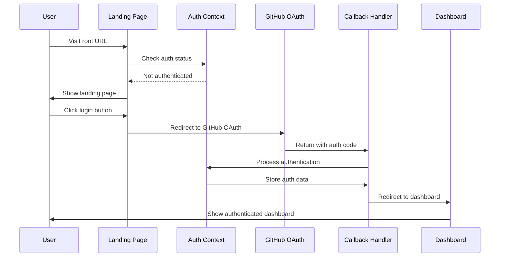

# Design Document

## Overview

The modern landing page feature will transform the current home page into a professional, conversion-focused landing page that clearly communicates the value proposition of Devorc Suite. The design will implement a seamless authentication flow that automatically redirects authenticated users to the dashboard while providing an engaging experience for new visitors.

The solution leverages the existing GitHub authentication infrastructure and dashboard components while introducing new routing logic and UI improvements to create a cohesive user journey from landing to dashboard.

## Architecture

### Component Architecture



### Authentication Flow



### Routing Strategy

The application will use Next.js App Router with the following route structure:

- `/` - Landing page (with auth redirect logic)
- `/dashboard` - Main dashboard (protected route)
- `/auth/github/callback` - OAuth callback handler (existing)

## Components and Interfaces

### 1. Enhanced Landing Page Component

**Location:** `src/app/page.tsx`

**Responsibilities:**
- Check authentication status on mount
- Redirect authenticated users to dashboard
- Display modern landing page for unauthenticated users
- Handle login button interactions

**Key Features:**
- Hero section with compelling value proposition
- Feature showcase cards (GitHub Dashboard, Smart Kanban, Project Canvas, AI Assistant)
- Prominent call-to-action button
- Responsive design with modern aesthetics
- Loading states during authentication checks

### 2. Authentication Route Guard

**Location:** `src/components/auth-guard.tsx` (new component)

**Responsibilities:**
- Wrap pages that require authentication
- Handle loading states during auth checks
- Redirect unauthenticated users to landing page
- Provide consistent auth state management

### 3. Enhanced Dashboard Layout

**Location:** `src/app/dashboard/page.tsx` (enhanced)

**Responsibilities:**
- Display GitHub integration status prominently
- Show connected user information
- Provide access to all main features
- Handle sign-out functionality with proper redirect

### 4. Navigation Components

**Enhanced Components:**
- `src/components/app-sidebar.tsx` - Add GitHub user info and sign-out
- `src/components/nav-user.tsx` - Display GitHub user data
- `src/components/site-header.tsx` - Add sign-out functionality

## Data Models

### Authentication State Interface

```typescript
interface AuthState {
  isAuthenticated: boolean;
  isLoading: boolean;
  user: GitHubUser | null;
  connection: GitHubConnection | null;
  error: string | null;
}
```

### Landing Page Props Interface

```typescript
interface LandingPageProps {
  features: FeatureCard[];
  heroContent: HeroContent;
  ctaButton: CTAButtonConfig;
}

interface FeatureCard {
  id: string;
  title: string;
  description: string;
  icon: string;
  color: string;
}

interface HeroContent {
  title: string;
  subtitle: string;
  description: string;
}

interface CTAButtonConfig {
  text: string;
  variant: 'primary' | 'secondary';
  size: 'sm' | 'md' | 'lg';
}
```

### Dashboard State Interface

```typescript
interface DashboardState {
  githubStatus: 'connected' | 'disconnected' | 'error';
  repositories: Repository[];
  user: GitHubUser;
  features: DashboardFeature[];
}

interface DashboardFeature {
  id: string;
  name: string;
  description: string;
  status: 'active' | 'inactive' | 'coming-soon';
  route: string;
}
```

## Error Handling

### Authentication Errors

1. **OAuth Callback Errors**
   - Display user-friendly error messages
   - Provide retry mechanism
   - Log errors for debugging
   - Redirect to landing page with error state

2. **Token Validation Errors**
   - Clear invalid tokens automatically
   - Show re-authentication prompt
   - Maintain user session context

3. **Network Errors**
   - Implement retry logic with exponential backoff
   - Show offline/connection status
   - Cache authentication state locally

### UI Error States

1. **Loading States**
   - Skeleton loaders for content areas
   - Progress indicators for authentication
   - Smooth transitions between states

2. **Error Boundaries**
   - Catch and display component errors gracefully
   - Provide fallback UI components
   - Log errors for monitoring

## Testing Strategy

### Unit Tests

1. **Authentication Context Tests**
   - Test authentication state management
   - Verify token storage and retrieval
   - Test error handling scenarios

2. **Component Tests**
   - Landing page rendering with different auth states
   - Dashboard component integration
   - Navigation component behavior

3. **Hook Tests**
   - GitHub API integration hooks
   - Authentication flow hooks
   - Local storage management

### Integration Tests

1. **Authentication Flow Tests**
   - Complete OAuth flow simulation
   - Token refresh scenarios
   - Sign-out and cleanup

2. **Routing Tests**
   - Protected route access
   - Redirect behavior
   - URL state management

3. **GitHub API Integration Tests**
   - Repository data fetching
   - User profile retrieval
   - Error handling for API failures

### End-to-End Tests

1. **User Journey Tests**
   - Landing page to dashboard flow
   - Authentication and sign-out
   - Feature access verification

2. **Cross-Browser Tests**
   - OAuth flow compatibility
   - Responsive design validation
   - Performance benchmarks

## Implementation Considerations

### Performance Optimizations

1. **Code Splitting**
   - Lazy load dashboard components
   - Separate authentication bundles
   - Optimize initial page load

2. **Caching Strategy**
   - Cache GitHub API responses
   - Store authentication state efficiently
   - Implement proper cache invalidation

3. **Loading Optimization**
   - Preload critical resources
   - Optimize image assets
   - Minimize JavaScript bundle size

### Security Considerations

1. **Token Management**
   - Secure token storage
   - Automatic token refresh
   - Proper token cleanup on sign-out

2. **Route Protection**
   - Server-side authentication checks
   - Client-side route guards
   - Prevent unauthorized access

3. **Data Validation**
   - Validate OAuth callback parameters
   - Sanitize user input
   - Implement CSRF protection

### Accessibility

1. **Keyboard Navigation**
   - Full keyboard accessibility
   - Proper focus management
   - Skip links for screen readers

2. **Screen Reader Support**
   - Semantic HTML structure
   - ARIA labels and descriptions
   - Proper heading hierarchy

3. **Visual Accessibility**
   - High contrast color schemes
   - Scalable text and UI elements
   - Reduced motion preferences

### Responsive Design

1. **Mobile-First Approach**
   - Touch-friendly interface elements
   - Optimized mobile navigation
   - Responsive grid layouts

2. **Breakpoint Strategy**
   - Mobile: 320px - 768px
   - Tablet: 768px - 1024px
   - Desktop: 1024px+

3. **Progressive Enhancement**
   - Core functionality without JavaScript
   - Enhanced features with JavaScript
   - Graceful degradation